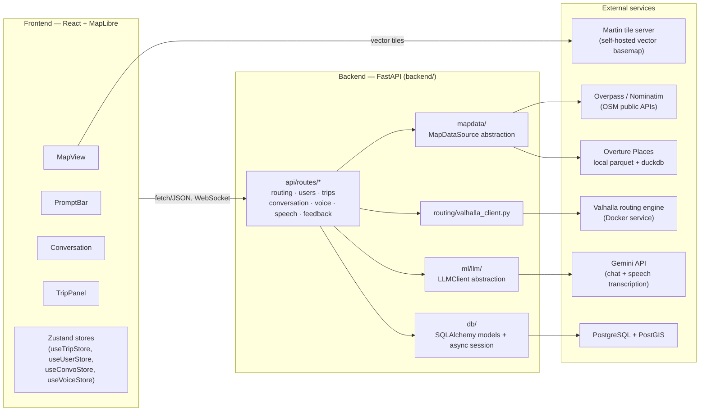
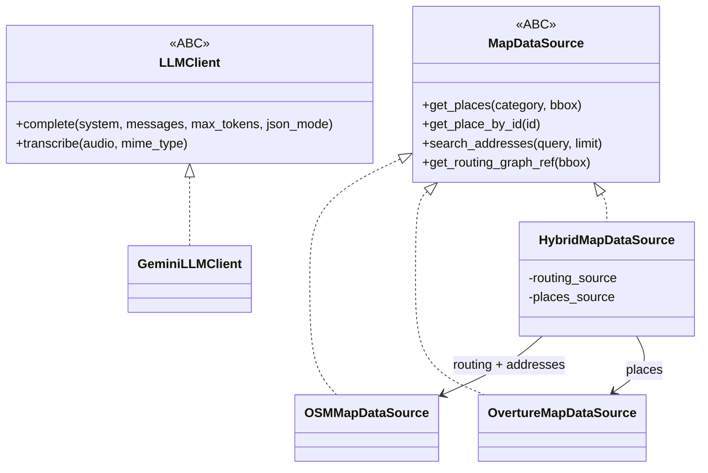

# System Architecture

## The three tiers

The backend is the only party that talks to Valhalla, OSM/Overture, or Gemini. The frontend only ever talks to the backend's own `/api/v1/*` surface (plus Martin directly, for map tiles) — see [API Specification](api.md).

## The abstraction-layer pattern (used twice, deliberately)

Two subsystems that would otherwise couple the whole codebase to a single external provider are instead built behind a small ABC + factory, so a provider swap or blend is "one new file + one config flip," not a rewrite. Both instances share the same shape:

### `backend/mapdata/` — MapDataSource

- **`models.py`** defines the only vocabulary enrichment/routing code is allowed to speak: `Place`, `Address`, `BBox`, `PlaceCategory`, `RoutingGraphRef`. No OSM tag or Overture schema field is ever supposed to leak past the implementation that produced it.
- **`base.py`** is the ABC: `get_places`, `get_place_by_id`, `search_addresses`, `get_routing_graph_ref`.
- **`osm_source.py`** implements it against the public Overpass API (places) and Nominatim (geocoding) — both require a `User-Agent` header or return `406`.
- **`overture_source.py`** implements it against a local GeoParquet extract of Overture's Places theme, queried with `duckdb` (no live API — see [ADR: Overture via local parquet + duckdb](decisions.md#overture-via-local-parquet--duckdb-not-a-live-api)). Category matching combines an exact-match dict with `_SUFFIX_RULES` (e.g. `%_restaurant`) because Overture's taxonomy leaves (`mexican_restaurant`) are more specific than OSM's.
- **`hybrid_source.py`** composes the two *per method*, not wholesale: `OSMMapDataSource` backs routing-graph refs and address geocoding (the only mature pipeline), `OvertureMapDataSource` backs place lookups (cleaner, deduped US POI data). `search_addresses` merges both concurrently (`asyncio.gather`) and de-dupes results within ~50 m, preferring the Overture copy for its cleaner name.
- **`factory.py`** — `get_map_data_source()` reads `settings.map_data_source` (`"osm" | "overture" | "hybrid"`) and constructs the right implementation. This is the **only** place in the codebase allowed to decide which provider is active.

The hard rule this pattern exists to enforce: **no code outside `backend/mapdata/` may import `httpx`/`requests` and call Overpass, Nominatim, or Overture directly.** See [ADR: MapDataSource abstraction](decisions.md#the-mapdatasource-and-llmclient-abstraction-layers).

### `backend/ml/llm/` — LLMClient

- **`base.py`** — the ABC: `complete()` (one chat completion, `messages: list[{"role", "content"}]`, optional JSON-mode) and `transcribe()` (optional capability, default raises `LLMUnavailable`). `LLMUnavailable` is the *only* exception type that crosses this boundary — provider-specific errors (HTTP failures, bad JSON, missing candidates) are caught and re-raised as `LLMUnavailable` inside each client.
- **`gemini_client.py`** — the only implementation today. Plain `httpx` against Gemini's REST `generateContent` endpoint (no SDK), translating the neutral `"user"/"assistant"` role vocabulary to Gemini's `"user"/"model"`. `transcribe()` sends audio inline as base64 with an instruction prompt; a `400` on `audio/webm` triggers one retry relabeled `audio/ogg` (same Opus bytes, a MIME type Gemini's docs actually list).
- **`factory.py`** — `get_llm_client()` reads `settings.llm_provider`; today only `"gemini"` is wired, and an empty `gemini_api_key` raises `LLMUnavailable` immediately (never a raised exception the caller has to guess about).

Every route that touches the LLM depends on `_llm()` (an async generator dependency in `conversation.py`, reused by `speech.py`) which turns `LLMUnavailable` into an HTTP `503`. The frontend treats `503` uniformly as "this feature is off," never as an error to surface — see `frontend/src/lib/api.ts`'s `openConversation`/`openDebrief` (return `null` on non-2xx) versus `replyConversation`/`replyDebrief` (throw `FriendlyError`, since by the time a reply is possible the feature was already confirmed on).

## Backend module map

| Module | Responsibility | Depends on |
|---|---|---|
| `api/main.py` | FastAPI app, CORS, router mounting, lifespan-managed Valhalla client pool | all routers, `routing.valhalla_client` |
| `api/routes/routing.py` | `POST /route` (costing + persistence), `GET /search` (geocoding) | `mapdata.factory`, `routing.valhalla_client`, `db.models.Trip/UserPreference` |
| `api/routes/users.py` | Register, fetch profile, patch preferences/journey | `db.models.User/UserPreference/UserJourneyProfile` |
| `api/routes/trips.py` | GPS breadcrumb append, trip completion | `db.models.Trip` |
| `api/routes/conversation.py` | Pre-trip open/reply, post-trip debrief open/reply, `_find_stop` helper | `ml.llm`, `mapdata.factory`, `db.models.TripConversation` |
| `api/routes/voice.py` | In-drive voice WebSocket — reuses `conversation.py`'s helpers | `ml.llm.conversation.interpret_navigation_reply`, `conversation._find_stop` |
| `api/routes/speech.py` | Server-side STT fallback (`POST /speech/transcribe`) | `ml.llm` via `conversation._llm` |
| `api/routes/feedback.py` | Raw post-trip text feedback | `db.models.Trip` |
| `config.py` | `Settings` (pydantic-settings) — every env-derived value, plus the container-vs-host hostname rewrite | — |
| `db/session.py` | Lazy async engine/session factory, same host-rewrite trick for `DATABASE_URL` | `config` |
| `db/models.py` | SQLAlchemy ORM models (see [Data Flow](data-flow.md) for the schema) | `db.base` |
| `mapdata/` | Place/address abstraction (above) | external HTTP/duckdb |
| `routing/valhalla_client.py` | `UserRoutingPrefs` → Valhalla `costing_options` translation, `ValhallaRouter` HTTP client | Valhalla service |
| `ml/llm/` | LLM provider abstraction (above) + `conversation.py` prompts/extraction | Gemini API |
| `ml/gnn/` | `ingest.py` (OSM → `road_segments`), `graph_builder.py` (`road_segments` → PyG `Data`), `model.py` (`RoadNetworkEncoder`, a GATv2 graph encoder) | PostGIS, PyTorch Geometric — **not yet wired into any API route**; this is groundwork for the Phase 3 RL state, built and tested in isolation |

## Frontend module map

The frontend is intentionally light on components; almost all logic lives in `stores/` (Zustand) and `lib/`, with components subscribing to store slices and calling store actions.

| Store | Owns | Notable behavior |
|---|---|---|
| `useTripStore` | Origin/destination/stops, fetched routes, selection, travel mode, navigation phase/progress, live position | `requestRoute()` is the single place that calls `getRoute()`; every mutation (`setDestination`, `moveEndpoint`, `setMode`, `addStop`, ...) funnels through it or `refreshRoute()`. Owns a non-serializable `DriveController` instance (kept outside React/Zustand state on purpose). |
| `useUserStore` | Locally-remembered user id + preferences + journey profile | Preferences are optimistic: set locally, `PATCH`ed, reverted on failure. Persists to `localStorage` under `gloway:user` so the panel renders instantly on reload without a network round trip. |
| `useConvoStore` | Pre-trip conversation open/reply state | `applyReplyResult()` (exported, not store-internal) is the shared side-effect applier — see below. |
| `useVoiceStore` | Whether assistant replies are read aloud (`autoSpeak`) | Persisted to `localStorage` under `gloway:voice`; auto-enables itself once, the first time the mic is used. |
| `useDebriefStore` | Post-trip debrief conversation | Mirrors `useConvoStore`'s open/reply shape for the debrief flow. |

`stores/useConvoStore.ts`'s exported `applyReplyResult()` function is the single place that turns a backend `ReplyResponse` (or the WebSocket voice `action` payload — same shape) into store mutations: route switch, stop insertion, travel-mode change, destination override, preference sync. Both the HTTP pre-trip reply path and the WebSocket in-drive voice path call it, so a spoken "take me home" mid-drive and a typed "take me home" pre-trip behave identically — see `api/routes/voice.py`'s docstring: *"`action` mirrors the HTTP `ReplyResponse` shape exactly (snake_case), so the frontend reuses the same reply-result parser."*

`lib/api.ts` is the only module that calls `fetch`/opens the WebSocket; every user-facing error string lives there (`FriendlyError`), so components and stores never format raw HTTP details for display.

`lib/navigation.ts`'s `DriveController` simulates a drive along the selected route's decoded polyline (ticking a synthetic position forward, since local dev has no real GPS inside the tiny Arlington tile region) and streams batched points to `/trips/{id}/gps-update` on the same cadence a real device would use `watchPosition` — the docstring is explicit that swapping the synthetic tick for real GPS fixes is the only change needed later; the batching/streaming/puck code downstream is already the production path.

## Data stores

- **PostgreSQL + PostGIS** — the system of record. See [`db/models.py`](../backend/db/models.py) for the ORM source of truth; schema history lives in `db/migrations/versions/` (Alembic). Tables: `users`, `user_preferences`, `user_journey_profiles`, `trips`, `trip_conversations`, `road_segments`.
- **Overture Places parquet** (`data/overture/places.parquet`) — a static, locally-generated extract queried in-process via `duckdb`. Not a database service; regenerated via `data/download_overture.sh`.
- **Valhalla tile graph** (`valhalla/custom_files/`) — the offline-built routing graph, OSM-only regardless of which `MapDataSource` backs places/addresses (see [Map Data Abstraction Layer](../adaptive_map_build_roadmap.md#map-data-abstraction-layer) in the roadmap).
- Redis/Celery/Qdrant/MLflow appear in `infra/docker-compose.yml` and the roadmap's tech-stack tables as **planned** infrastructure for Phase 2/3 (async signal processing, preference embeddings, experiment tracking) — nothing in the current backend code reads or writes to them yet.

## What's built vs. what's scaffolding

This matters for anyone extending the system — don't assume roadmap ambition equals shipped behavior:

- **Shipped and wired end-to-end:** routing with preference-driven costing, geocoding/place search, user registration + preferences + journey profile, trip persistence + GPS breadcrumbs + completion, the pre-trip conversation, the post-trip debrief (writes `trips.reward_value`), the in-drive voice WebSocket, server-side STT fallback.
- **Built and tested, not yet wired into a request path:** `ml/gnn/` (road graph ingestion + GATv2 encoder) — this is Phase 3 (RL) groundwork; nothing in `api/routes/` calls it yet. `UserPreference.preference_vector` and `UserJourneyProfile.driving_persona`/`known_regular_routes` columns exist but nothing currently writes non-null values into them.
- **Referenced in `docker-compose.yml`/roadmap, not present in backend code at all:** Celery task queue, Redis caching, Qdrant vector store, MLflow tracking, federated learning (Flower), RL training loop (Stable Baselines3/Ray).

## Related pages

- [Data Flow & Sequence Diagrams](data-flow.md) for how a request actually moves through these modules.
- [API Specification](api.md) for the exact request/response contracts.
- [Decision Records](decisions.md) for why the abstraction layers, provider choices, and a few subtler fixes (atomic GPS append, Valhalla costing clamping) exist.
