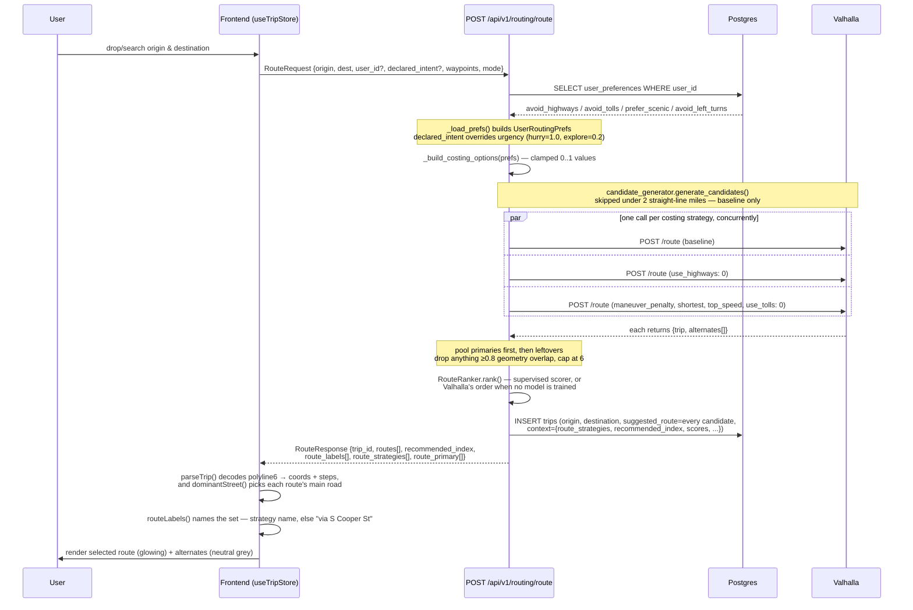
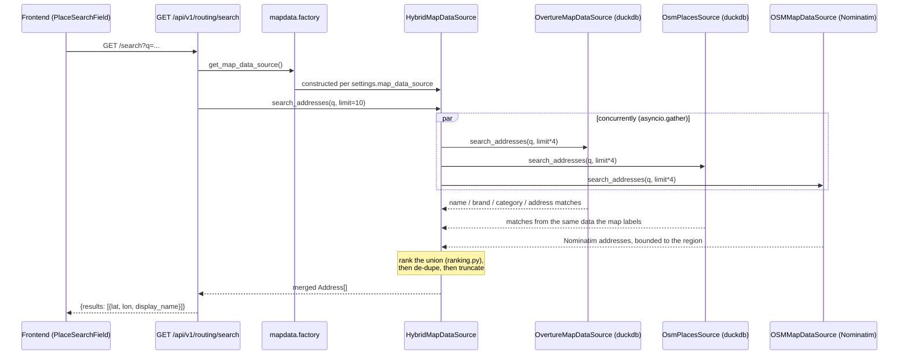
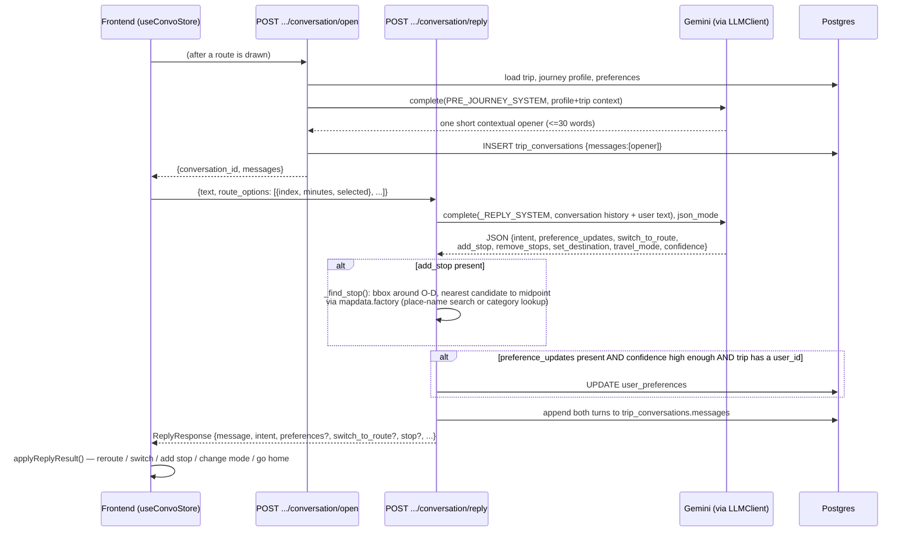
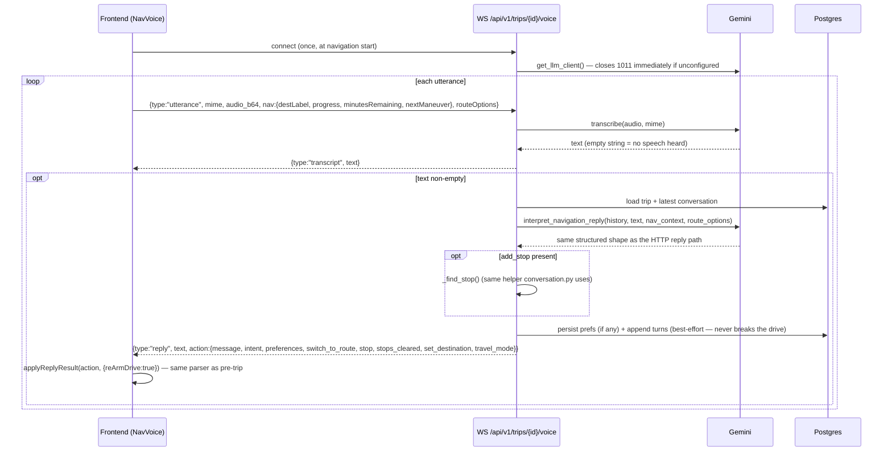
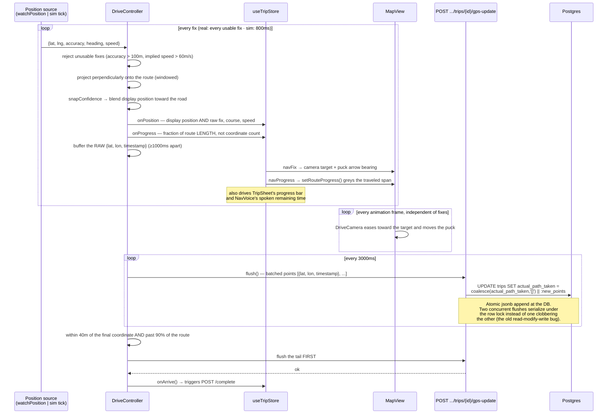
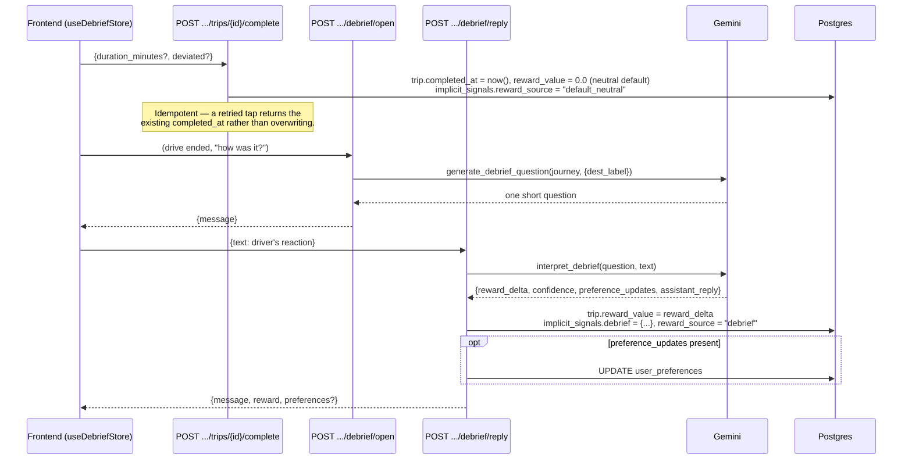
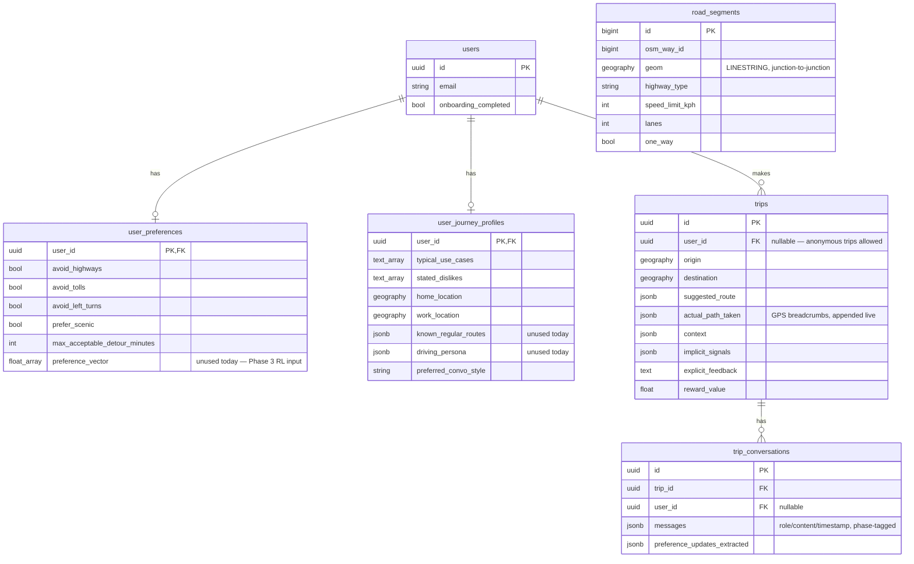

# Data Flow & Sequence Diagrams

## 1. Route calculation

The core loop: pick two points, get a route, and have that request itself become training data for later.

Every route request is persisted as a `trips` row **whether or not** anyone consumes it downstream yet — this is the raw material the Phase 3 RL trainer will eventually read (`suggested_route`, `context`, later `actual_path_taken` and `reward_value`). See `api/routes/routing.py`'s module docstring.

The sweep exists because one call is not enough: on a measured Arlington pair, Valhalla's three "alternates" were two copies of one road plus one bad option, so ranking had nothing real to choose between. See [ADR: sweep several costing strategies](decisions.md#sweep-several-costing-strategies-instead-of-trusting-one-valhalla-call).

If Valhalla returns a `4xx` (point outside the tiled region, unroutable), the backend forwards that status with Valhalla's error detail rather than a blind `500`; a `503` is returned if Valhalla is unreachable at all. The frontend maps both into one of two fixed, friendly strings (`ENGINE_DOWN_MESSAGE` / `OUT_OF_AREA_MESSAGE`) — see `lib/api.ts::getRoute`.

## 2. Geocoding / place search

Any branch failing (`return_exceptions=True` in the `asyncio.gather`) degrades to the other sources' results rather than failing the whole search — see `hybrid_source.py`.

Each source is asked for more than the caller wants so the ranker has candidates to choose between; ranking happens **after** the merge, or a source listed first could fill the limit with weak matches and discard a better one another source had found. Two places supply results because the map's labels and Overture are different providers with different vocabularies — see [Decisions](decisions.md#destination-search-indexes-osm-as-well-as-overture).

## 3. Pre-trip conversation

Key extraction rules baked into the `_REPLY_SYSTEM` prompt (`ml/llm/conversation.py`): a one-off "avoid the highway *today*" is `intent`, not a durable `preference_updates` entry; only a clearly-stated durable preference (`"I hate highways"`) writes to `user_preferences`. Extractions below `CONFIDENCE_FLOOR = 0.5` are dropped for preferences (but `intent` always passes through — a wrong one-trip guess is cheap to undo, a wrongly-persisted preference isn't).

## 4. In-drive voice (WebSocket)

The same reply-interpretation contract as above, but over a persistent connection held open for the whole drive, with live navigation context riding along each utterance.

`action`'s shape is byte-for-byte the same as the HTTP `ReplyResponse` (snake_case field names preserved over the wire) specifically so the frontend's `applyReplyResult()` handles both without a second parser. The one difference: `reArmDrive: true` tells the trip store to restart the (simulated) drive on the newly-computed route after any reroute, so a mid-drive "take me home" doesn't silently end navigation.

## 5. The live drive loop

One position source feeds four consumers plus the backend. `DriveController` has two
interchangeable modes — `real` (`watchPosition`) and `sim` (walks the route's own coordinates on
a timer, selected with `?sim=1`) — and everything downstream is identical in both, which is what
makes sim an honest stand-in outside the tiled region. That equivalence is load-bearing and has to
be maintained: sim fills course, speed and snap confidence with real values rather than leaving
them blank, and `?sim=1&jitter=8` scatters its emitted position so the snapping path can be
exercised without a car.

Note the two rates. Fixes arrive about once a second and update the camera's *target*; the camera
itself moves every animation frame. And note which position goes where: the display position is
snapped to the road, the position sent to the backend never is.

Two orderings in there are load-bearing:

- **The tail flush precedes `onArrive`.** `onArrive` triggers `POST /complete`, and completion
  scores adherence against whatever GPS has reached the server. A fire-and-forget flush raced the
  request, and the last seconds of every drive — often the whole trace — arrived too late to
  count, leaving `implicit` null on every trip in the database.
- **Arrival needs both proximity and progress.** The 90% tail check stops a loop-shaped route
  (destination near origin) from "arriving" the moment the drive starts.

See [ADR: atomic GPS append](decisions.md#atomic-jsonb-append-for-gps-breadcrumbs-not-read-modify-write) for why the append is a single `UPDATE ... = col || :new` rather than reading the array into Python, appending, and writing it back — and [ADR: distance-based progress](decisions.md#progress-is-a-fraction-of-length-not-of-coordinate-count) for why `onProgress` reports length rather than index.

## 6. Post-trip debrief → reward signal

This is the pipeline that eventually feeds RL training: a driver's reaction to the trip becomes a numeric `reward_value` on the `trips` row.

Every completed trip gets a `reward_value` — `0.0` by default the moment `/complete` is called, overwritten by the real `reward_delta` if the driver actually finishes the debrief. This guarantees the Phase 3 RL trainer always has a reward to read, never a `NULL`, regardless of how engaged the driver was.

## Schema (entity relationships)

`road_segments` has no foreign key to anything else — it's populated wholesale from an OSM extract by `backend/scripts/ingest_road_segments.py` / `ml/gnn/ingest.py`, and consumed only by `ml/gnn/graph_builder.py` (not yet by any API route).
